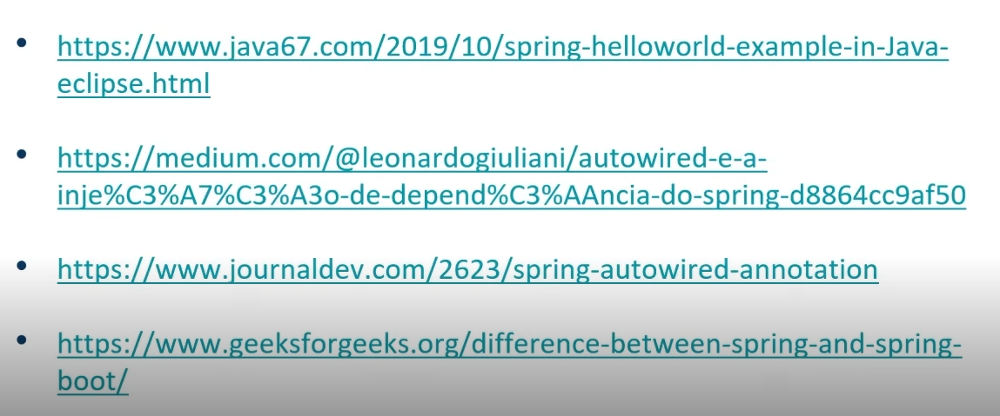

# Imersão no Spring Framework com Spring Boot

## O que é o Spring Framework

Framework open source baseado nos padrões de projetos **inversão de controle e inversão de dependências**.

Composto por módulos afim de reduzir a complexidade no desenvolvimento de aplicações simples ou corporativa.

- core, web, data, etc.
- Spring x Java EE: antigamente o JEE era muito complicado, mas com o tempo, o JEE tornou-se mais praticável e estão muito equivalentes.
- IoC: minimizar o acoplamento de código.
- Injeção de dependências: baixo nivel de acoplamento.
- Beans: Objeto gerenciado pelo container.
- Scopes: singleton, prototype, http.

## Projeto Springboot

- Sprinbboot: baseado no padrão de injeção de dependências com configuração automática.
- Desafios antes do SB: dependência individual, verbosidade, complexidade de gestão.
- Como a maior parte das configs para os projetos eram sempre as mesmas, podemos iniciar um projeto com essas configs prontas, starters.
- Benefícios:
  - coesão
  - versões compatíveis
  - otimização de tempo
  - configuração simples e foco no negócio.
  - Starters: data-jpa, data-mongodb, web, web-services, batch, test, openfeign, actuator.

- Quando usar Bean: Quando nao tenho acesso ao codigo fonte.
- Quando usar Component: Quando temos acesso ao codigo fonte
- Implementar IoC e DI.

**Scopes - Singleton ou Prototype**

Singleton: unico objeto 
Protype: um objeto a cada requisição.

## Para saber mais:

- [slides](https://docs.google.com/presentation/d/1VfMegq5Je5qO4IP8chi2x4YR4ACOfBbN/edit?usp=sharing&ouid=105300330738120646134&rtpof=true&sd=true)

- [https://github.com/digitalinnovationone/dio-springboot](https://github.com/digitalinnovationone/dio-springboot)
- [https://docs.google.com/presentation/d/1jS5Ov8UCSnzgW3TLBcAsGrXo__kL6FOG/edit#slide=id.p24](https://docs.google.com/presentation/d/1jS5Ov8UCSnzgW3TLBcAsGrXo__kL6FOG/edit#slide=id.p24)
- 

